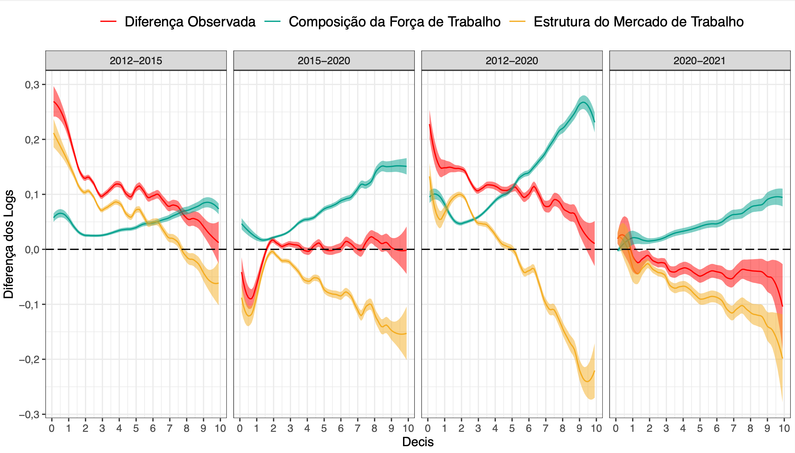
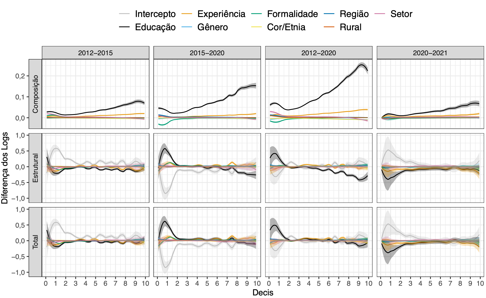

# A nova década perdida e a pandemia: uma análise da distribuição de renda e do recrudescimento da desigualdade no Brasil a partir de Regressões RIF

Repositório com os scripts, planilhas e figuras usados no artigo "A nova década perdida e a pandemia: uma análise dos determinantes do recrudescimento da desigualdade no Brasil a partir de Regressões RIF".

O arquivo .R principal é o "Analise_PNADC.R", que contém as principais manipulações, análises descritivas e regressões.
Além disso, ele gera o .dta usado nas decomposições empregadas em "RIF-Hora_Oaxaca_Decom.do", cujos resultados, por sua vez, são editados e organizados no Excel por VBA e grafados no "Graficos_OaxacaRIF.R".

-----
## Dados

Por limitação de espaço no GitHub, os dados brutos do artigo não estão na pasta.
Contudo, os dados filtrados (já retirados os desocupados) se encontram na pasta 'PNADC'.
O zip do arquivo .dta usado nas decomposições e que contém a base manipulada e filtrada (idade entre 15 e 64 anos e com rendimentos reportados) com as informações dos primeiros trimestres dos anos de 2012, 2015, 2020 e 2021 também se encontra na mesma pasta.

Os microdados brutoos referentes aos 1º trimestres da PNADC de 2012, 2015, 2020 e 2021 podem ser baixados no [site do IBGE](https://www.ibge.gov.br/estatisticas/sociais/trabalho/17270-pnad-continua.html?=&t=downloads).

Contudo, em 30 de novembro de 2021, o IBGE realizou reponderações em seus pesos via *bootstrap* que **não** foram incorporadas no artigo. Mais detalhes podem ser vistos em:

- https://agenciadenoticias.ibge.gov.br/media/com_mediaibge/arquivos/2a5121f2c185216de059827d000e8076.pdf
- https://agenciadenoticias.ibge.gov.br/media/com_mediaibge/arquivos/e12350e46c4b95a38176d9e5356618f4.pdf

-----
## Prints

